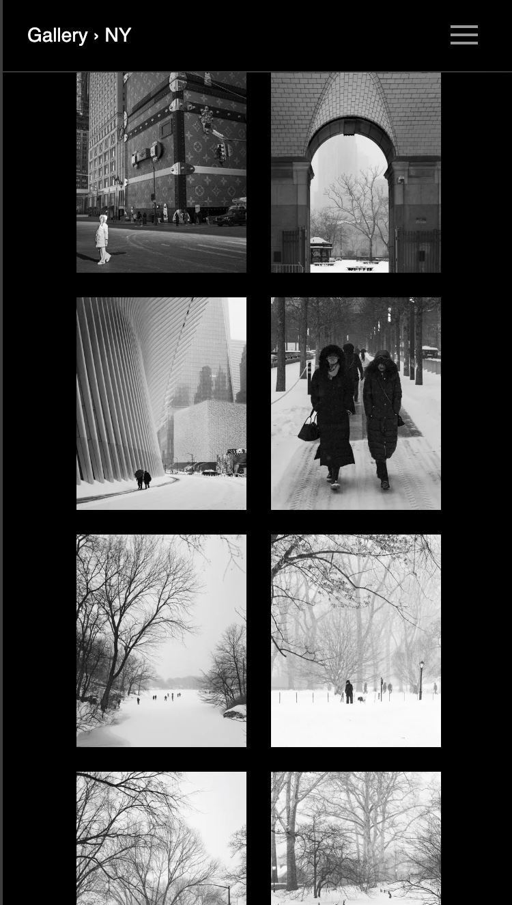

# simple-gal

A photography-oriented image gallery generator. It leverages the information in your files, can be dropped onto any server or platform, and produces a clean, fast user experience. No bullshit.

## The Pain

Photographers, pros or otherwise, amass a lot of image galleries over time to showcase their work. While there are many platforms, SaaS products, apps, and generators for image galleries, most of them invariably:

- Bolt on features for the platform, not for you (login, likes, comments).
- Ship updates that break or change things.
- Charge subscription fees.
- Require server infrastructure with maintenance, updates, and vulnerabilities.
- Use bespoke data models that force you to redo all the curating work on migrations.
- Offer poor photographic control: compression, sharpening, aspect ratios, image and gallery ordering.

simple-gal is a solution born out of this pain. It aims to be useful, simple, and maintenance-free 30 years from now. It shelters you from technological, business, and product changes (as much as possible), and puts your image files at the center as the source of truth: no tool-specific data formats to migrate from.

| Gallery page | Photo page |
|:---:|:---:|
|  |  |

## What simple-gal Gives You

- **Future-proof / Resilient**:
  - **The tool**: no external deps, pre-compiled binaries. As long as you can run a Unix program, it works.
  - **The output**: tried-and-true HTML elements and established CSS, with only ~30 lines of vanilla JavaScript (keyboard and swipe only — click navigation is pure HTML/CSS). No dependencies, no front-end toolchain. Unless browsers break fundamental HTML support, you're good.
  - **Formats**: TIFF, JPEG, and AVIF output.
  - **Hosting**: just drop the generated directory onto any file server. No configuration required.
- **Photographic Control**:
  - **Image quality**: fine-tune compression and sharpening, per size.
  - **Aspect ratios**: changeable per gallery, configurable for thumbnails. No more generic center crops.
  - **Responsive image sizes**: fine control over several responsive dimensions so users download the smallest file for their screen without aggressive in-browser downscaling.
- **User Experience**:
  - **Page-based**: robust navigation with smooth transitions.
  - **Lightning fast**: ~9 KB per page (sans image files) and a simple render pipeline. It's instant.
  - **Mobile-first**: swipes and edge clicks that users have come to expect.
  - **Installable**: every gallery is a PWA — add it to your home screen for app-like, offline-capable viewing.
- **Design**:
  - **Minimal**: clean and good-looking. No distractions, no fads.
  - **Tweakable**: change colors, fonts, and other details via config.
  - **Light/dark mode**: respects the user's system preference.

## Structuring Your Galleries

The directory and file structure is the source of truth for your data.

In your content root (`content/` by default), each directory is a gallery containing images. Or it can be a group (like "Travel") under which galleries are nested (say "Paris", "London"), so that navigation can group your galleries thematically.

Galleries and images are ordered by a numeric prefix (e.g. `001-Paris`, `002-London`).

- **Photo title**: from the IPTC tag if available, otherwise the filename (e.g. `003-Dusk.jpg` becomes "Dusk").
- **Photo description**: from the IPTC tag if available, otherwise from a same-name `.txt` sidecar (e.g. `003-Dusk.txt`).
- **Gallery names**: from the directory name. Descriptions from `description.md` (or `.txt`) inside the directory.

A `config.toml` in the content root sets global preferences. Each gallery can have its own `config.toml` — only changed properties need to be listed; the rest are inherited from parents.

Any `NNN-<name>.md` file in the content root is added as a page in the navigation (e.g. `001-About.md`).

```text
content/
├── config.toml                    # Site configuration (optional)
├── assets/                        # Static assets → copied to output root
│   ├── favicon.ico                # Auto-detected, injected into <head>
│   └── fonts/                     # Custom fonts (referenced in config.toml)
├── 040-about.md                   # Page (numbered = shown in nav)
├── 050-github.md                  # Link page (URL-only .md file)
├── 010-Landscapes/                # Album (numbered = shown in nav)
│   ├── config.toml                # Per-gallery config (overrides parent)
│   ├── description.txt            # Optional album description
│   ├── 001-dawn.jpg               # Preview image (lowest number)
│   ├── 001-dawn.txt               # Image sidecar description
│   ├── 002-sunset.jpg
│   └── 010-mountains.jpg          # Non-contiguous numbering OK
├── 020-Travel/                    # Container directory (has subdirs)
│   ├── config.toml                # Group config (applies to all children)
│   ├── 010-Japan/                 # Nested album
│   │   ├── config.toml            # Gallery config (overrides parent)
│   │   ├── description.md         # Markdown description
│   │   └── 001-tokyo.jpg
│   └── 020-Italy/
│       └── 001-rome.jpg
├── 030-Minimal/                   # Album with a single image
│   └── 001-solo.jpg
└── wip-experiments/               # No number prefix = hidden from nav
    └── 001-draft.jpg
```

Key points:

- Ordering is done with numeric prefixes.
- Items without a prefix are processed but hidden from navigation and thumbnail grids; they remain accessible by direct URL.
- Metadata can come from the image's IPTC tags, sidecar files, or filenames.
- Configuration cascades: root > group > gallery. Only overridden values need to be specified.

## Static Assets

The `assets/` directory (configurable via `assets_dir` in `config.toml`) is copied verbatim to the output root. Use it for favicons, custom fonts, or any other static files your site needs.

Favicon files (`favicon.ico`, `favicon.svg`, `favicon.png`) are auto-detected and injected as `<link rel="icon">` in every page.

To use a custom/downloaded font instead of Google Fonts:

```toml
[font]
font = "My Custom Font"
weight = "400"
font_type = "sans"
source = "fonts/MyFont.woff2"   # path relative to site root
```

Place the font file in `assets/fonts/` and it will be copied to `dist/fonts/` during build. When `source` is set, a `@font-face` declaration is generated and Google Fonts loading is skipped entirely.

## Custom CSS & JS

Drop any of these convention files into your `assets/` directory to inject custom content — no configuration needed:

| File | Injection point | Use case |
|------|----------------|----------|
| `custom.css` | `<link>` after main styles | CSS overrides, layout tweaks |
| `head.html` | End of `<head>` | Analytics (GA, Plausible), Open Graph meta tags |
| `body-end.html` | Before `</body>` | Tracking scripts, chat widgets, cookie banners |

For example, to add Plausible analytics, create `assets/head.html`:

```html
<script defer data-domain="photos.example.com" src="https://plausible.io/js/script.js"></script>
```

To override gallery styles, create `assets/custom.css`:

```css
.album-grid { gap: 0.5rem; }
```

The files are injected as-is — broken syntax won't break the build, it will just produce broken output.

## PWA / Installable Gallery

Every generated site is a Progressive Web App out of the box — no configuration needed. Visitors can "Add to Home Screen" on any device to get an app-like experience with:

- **Offline viewing**: pages and images you've already visited are cached and available without internet.
- **App-like display**: opens in standalone mode (no browser chrome), matching the gallery's clean aesthetic.
- **Automatic updates**: when you rebuild and deploy, the service worker picks up the new version on the next visit.

The gallery name on the home screen comes from `site_title` in your `config.toml`. Default PWA icons are provided; override them by placing `icon-192.png`, `icon-512.png`, or `apple-touch-icon.png` in your `assets/` directory.

**Note**: the site must be deployed at the root of its domain (e.g. `photos.example.com/`, not `example.com/photos/`).

## GitHub Action

The easiest way to use simple-gal — no installation needed. See [simple-gal-action](https://github.com/arthur-debert/simple-gal-action) for setup instructions and a complete deploy workflow.

## Local Usage

Grab a pre-built binary from the [releases page](https://github.com/arthur-debert/simple-gal/releases), or install via Cargo:

```bash
cargo install simple-gal
```

By default, the content root is `content/` and the output is `dist/`, both relative to the current directory.

```bash
# Full build (scan + process + generate)
simple-gal build

# Override paths
simple-gal --source photos --output public build

# Run individual stages
simple-gal scan                # Reads the content root, writes manifest.json to --temp-dir
simple-gal process             # Generates responsive image sizes to --temp-dir
simple-gal generate            # Uses manifest + processed images to produce final HTML

# Generate a stock config.toml with all options documented
simple-gal gen-config
```
